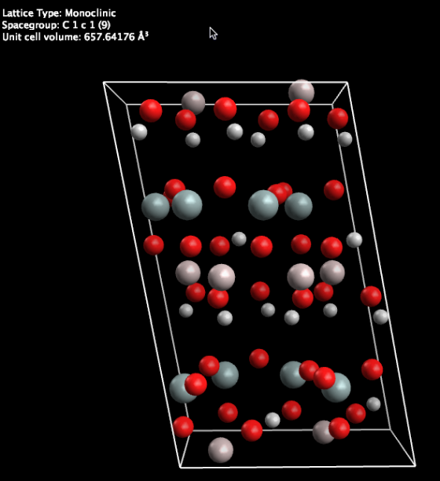
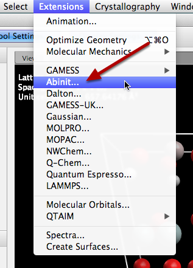
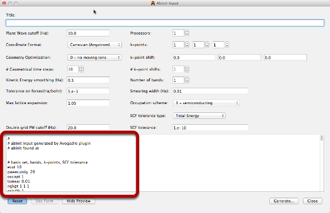
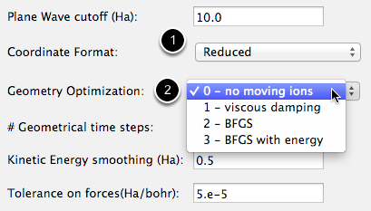
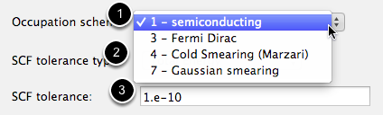
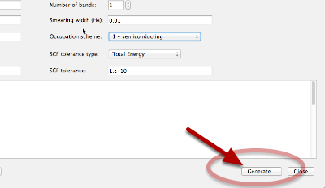

# ABINIT Input Generator

Avogadro has a new interface to the open source solid-state code ABINIT, provided by one of the ABINIT developers, Prof. Matthieu Verstraete

Start with a crystal structure — here a clay mineral from the new Avogadro crystal library.

Open up the Abinit input generator under the Extensions menu

Most common options for Abinit are available here, with a text preview \(highlighted in red\) generated as you change options above.

The input generator allows you to \(1\) pick the type of coordinates: real-space Cartesians or reduced coordinates and \(2\) pick the type of geometry optimization \(if any\).

Another important option is setting the occupation scheme \(1\) and SCF options \(2\) and \(3\).

Finally, when finished, you can click the “Compute” button \(not pictured\) if Abinit is available locally on your computer, or “Generate” to save the input file for submission to a remote queue.

Save the input file and you‘re finished!

