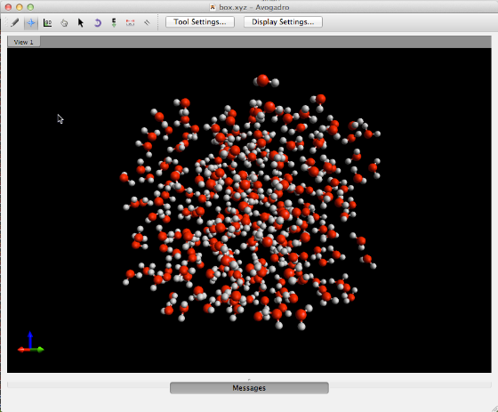
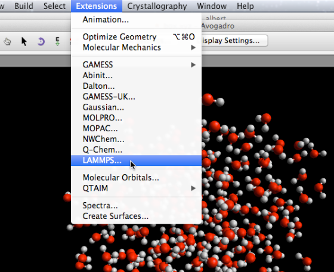
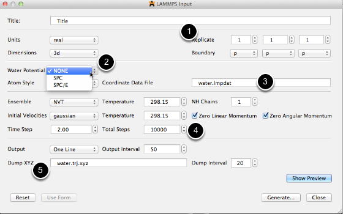
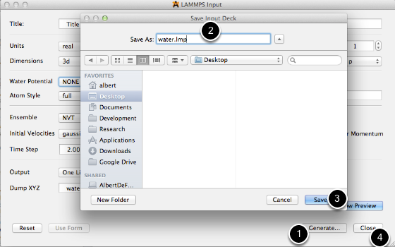
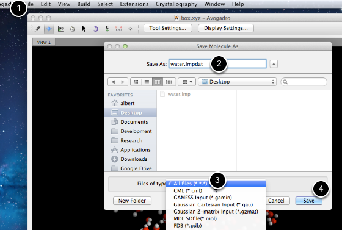
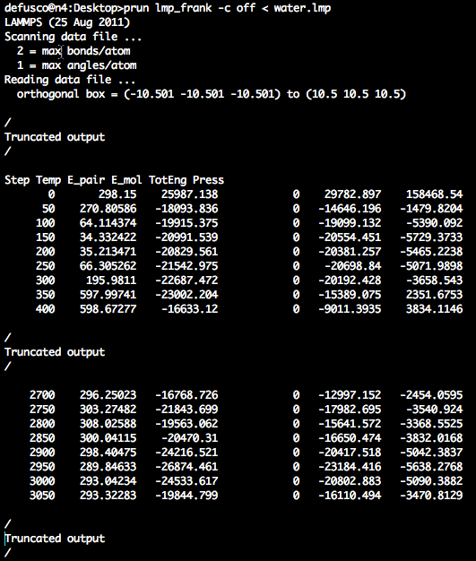

# LAMMPS Input

## Prepare initial geometry

The independently developed Packmol extension can be used to generate a box of water molecules.

## Open the LAMMPS input dialog

## Prepare simulation parameters

1. Choose the number of repeating units of the input coordintes in x, y and z directions
2. Choose the water potential.  The current version supports SPC and SPC/E model potentials
3. Choose the name of LAMMPS formatted coordinates.  The name will be used in a later step when the lmpdat file is created.
4. Choose the total number of MD steps.
5. Choose the file name of the XYZ formatted trajectory file.

## Generate the LAMMPS parameters file

1. Click the Generate button
2. Choose a file name
3. Click save
4. Close the input generator dialog

## Generate the LAMMPS Coordintes file

1. Select "Save As" from the file menu
2. Input the "water.lmpdat" file name from above
3. Select "All files"
4. Save the LAMMPS formatted coordinates file

## Run LAMMPS

After 2700 time steps, the temperature is begining to stabilize.

