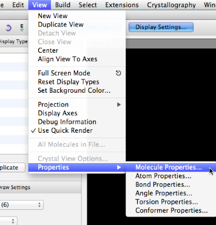
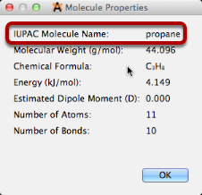
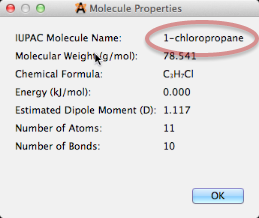

# Naming a Molecule

Avogadro 1.1 and later includes support for naming compounds using the NIH Chemical Resolver system and the PubChem database.

Open up the Molecule Properties window, under the View menu.

The IUPAC name will initially show as \(pending\) while the server returns the name, \(unknown\) if the molecule is not found in the resolver, or \(unavailable\) if your network connection is down or the resolver service is otherwise unreachable.

As you modify the molecule \(e.g., adding a Cl atom\), the name will update automatically with the other properties.

