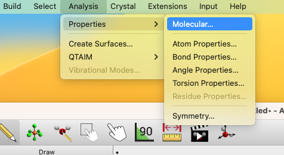
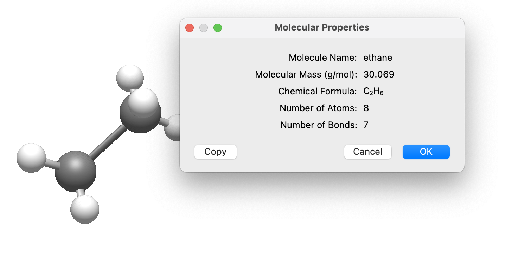
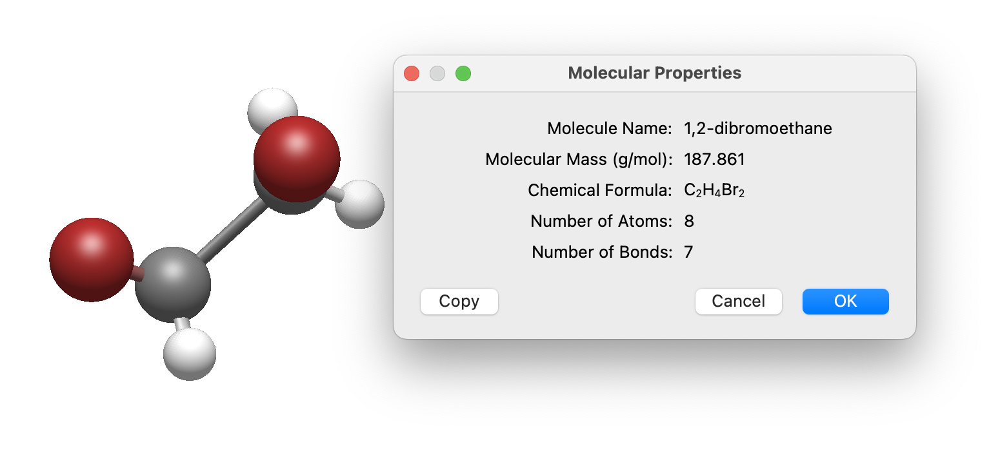

# Naming a Molecule

Avogadro includes support for naming compounds using a network request to the PubChem database, which includes over 112 million compounds. Since these are deposited by chemical suppliers, pharmaceutical companies, etc. the database may not cover _**every**_ molecule you may build, but includes a broad selection of compounds.


Your computer must be connected to the Internet to retrieve molecular names.


Open up the Molecule Properties window, under the View menu.

The IUPAC name will initially show as (pending) while the server returns the name, (unknown) if the molecule is not found in the resolver, or (unavailable) if your network connection is down or the resolver service is otherwise unreachable.

As you modify the molecule (e.g., adding Br atoms), the name will update automatically with the other properties, albeit while temporarily showing (pending)
