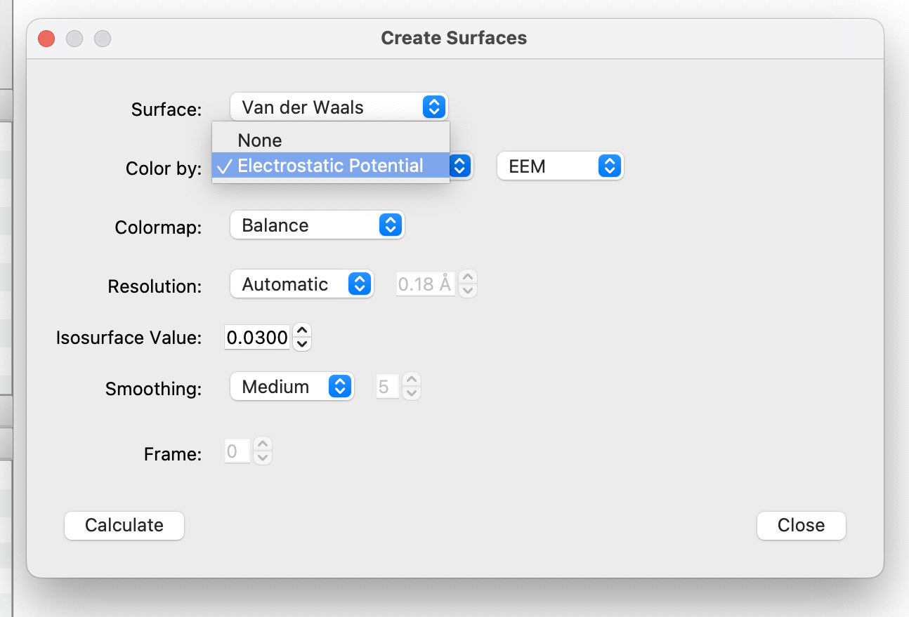
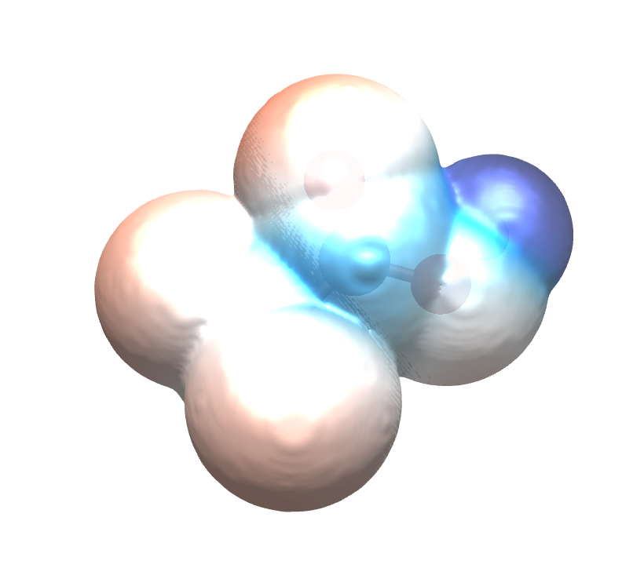
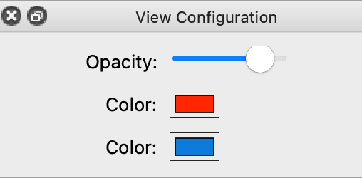

# Viewing Electrostatic Potential Maps

The electrostatic potential maps help to visualize charge distribution, and other charge related properties of molecules.

Overall, let's say you want to determine visually if a specific proton has more or less electron density. First, you'll want to begin with your molecule of choice (shown below is trifluoracetic acid).

Then under the "Analysis" menu, select "Create Surfaces...".

A dialog box will pop up providing you with various surface options. Under "Color By:" select "Electrostatic Potential", and optionally the electrostatic model (e.g., EEM or Gasteiger or MMFF94). You can also select a colormap (e.g., Balance, Coolwarm, Spectral, Turbo). Then click "Calculate". After Avogadro calculates the surface select "Close".

An electrostatic surface has now been created. From this surface, you can interpret where the most electron density resides (in the more red areas), and where the least electron density resides (deep blue areas). You can further determine, and compare the acidity of various protons, and how surrounding atoms impact the overall electron density.

This example was taken from "Exploring the Acidity of Organic Molecules with Avogadro" written by Tamika Madison.

## Changing Surface Settings

The opacity of the surface can the be changed by clicking the  "Meshes" display type and tweaking the display to your liking.

