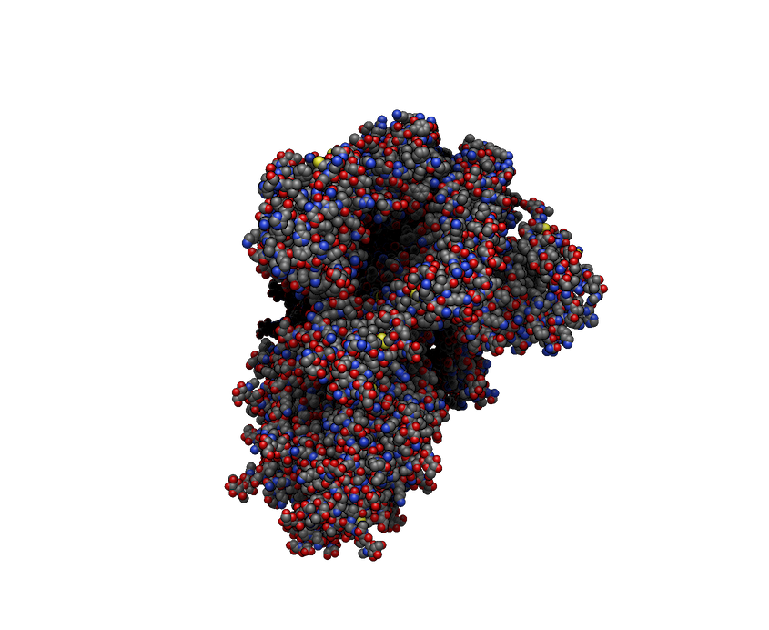
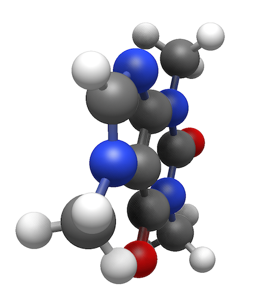
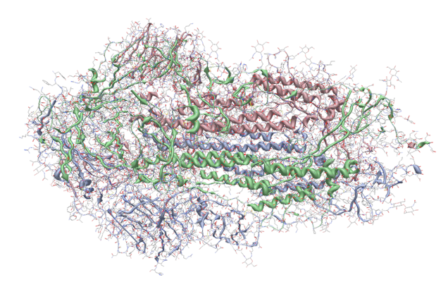
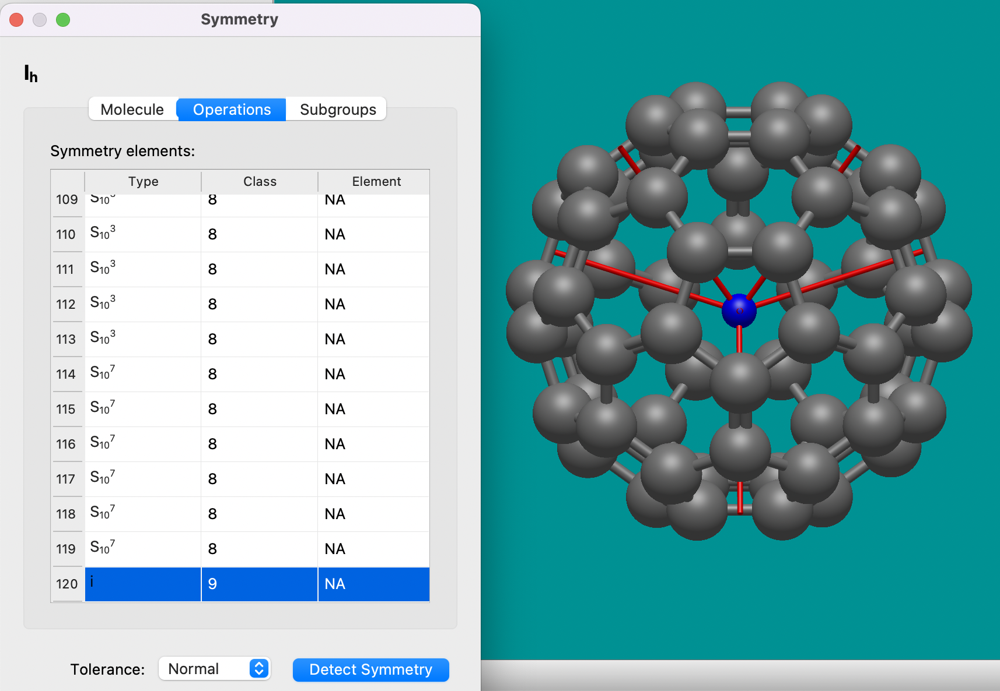
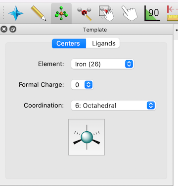
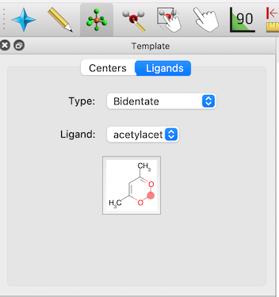

# Major New Features

### Speed and Stability

A major concern with Avogadro 1.x was speed on larger systems including biomolecules (protein, DNA/RNA) and materials. Even viewing / rotating large molecules would be slow, much less editing or performing optimizations or dynamics calculations.

We also know that Avogadro 1.x crashed for multiple reasons - not least because we used older rendering code which was not well supported by modern graphics cards and drivers.

Avogadro 2.0 has been rewritten from the ground up. **Avogadro v2 was designed for fast modern rendering and improved stability. It is a platform to make it easy to build the next generation of molecular and materials visualization and editing tools.**

### Rendering

Avogadro's new rendering framework _**easily**_ handles tens and hundreds of thousands of atoms – not just because hardware has improved but by using new 3D graphics rendering methods which make better use of modern GPUs.

<figure><figcaption>
Example of real-time shadows and depth effects on COVID spike protein (PDB: 6vxx) - around 25,000 atoms
</figcaption></figure>

#### New real-time shadows and depth effects

The new rendering system not only handles more atoms, but real-time shadows (also called ambient occlusion) provide depth effects which make even smaller molecules look more like physical models.

<figure><figcaption>
Ball and stick model of caffeine molecule showing real-time shading
</figcaption></figure>

#### New "close contact" rendering

#### New non-bonded rendering analysis, including hydrogen bonds, halogen bonds, and chalcogen bonds

#### New cartoon / ribbon styles for proteins

<figure><figcaption>
Example ribbon / cartoon view of COVID spike protein (PDB: 6vxx)
</figcaption></figure>

### Layers

A major new feature in Avogadro 2 is the layer system. You can create new layers for a wide variety of tasks:

* hide part of the molecule (e.g., put solvent into one layer and hide it during analysis or editing)
* change rendering options (e.g., display a protein with cartoon, but show a few key residues with ball-and-stick rendering)
* lock a layer to prevent editing (e.g., moving a molecule to bind with a locked surface or protein active site)

A new section on the Layer dock and tutorials on using layers for common tasks is available.

Future development will help use layers for complex simulations (e.g., QM/MM with one layer defining the quantum chemical fragments).

### Symmetry Properties

Avogadro 2 includes a new tool to perceive molecular symmetry, display symmetry elements, and explore subgroups and classes of symmetric atoms. You can find it under the Analysis => Properties submenu.

<figure><figcaption>
Example of symmetry detection and rendering on C60 molecule, showing inversion center and C5 rotations
</figcaption></figure>

### Template Tool

A new "template tool" makes it easy to build inorganic/organometallic complexes with different geometries and ligands.&#x20;

<figure><figcaption></figcaption></figure>

The "click to add" feature for ligands also works well for adding functional groups like phenyl rings, or a wide range of other fragments.

<figure><figcaption></figcaption></figure>

### Solvent Accessible and Solvent Excluded Surfaces

### Flexible Electrostatics Models

### Python Commands / Plugins

With Avogadro 2, it's easier than ever to create a quick Python script and add it as an Avogadro command. These scripts can modify the molecule / atoms (e.g., add a solvent box), run analysis (e.g., assign R and S stereochemical labels with `rdkit`), optimize the geometry, create nanoparticles or nanotubes using installed Python modules (e.g., `pymatgen` or `ASE`), generate ice crystal structures, solvate molecules, and many more.

You can also share your plugins through GitHub and others can download and instal or update to new versions through the "Download Extensions" command.

